LAST UPDATED:Sep 29th 2026

<!-- Profile README for github.com/Mr-Fahad-Rajput. Images live in /assets; each has a light and a dark version. -->

<picture>
  <source media="(prefers-color-scheme: dark)" srcset="assets/hero-dark.png">
  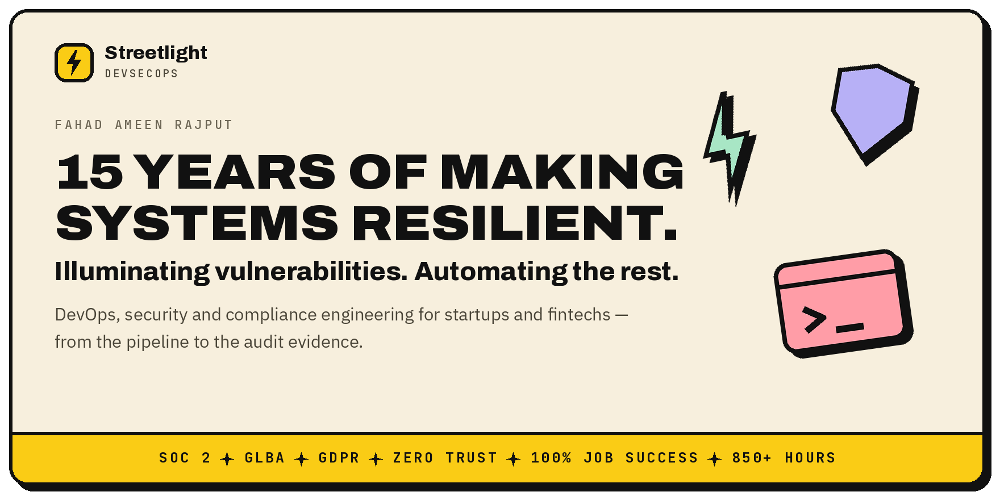
</picture>

  <a href="https://faadii.com"><picture><source media="(prefers-color-scheme: dark)" srcset="assets/btn-site-dark.png"></picture></a>
  <a href="https://www.upwork.com/freelancers/~019d63159a9ef9ed04"><picture><source media="(prefers-color-scheme: dark)" srcset="assets/btn-upwork-dark.png"></picture></a>
  <a href="https://www.linkedin.com/in/mr-fahad-rajput/"><picture><source media="(prefers-color-scheme: dark)" srcset="assets/btn-linkedin-dark.png"></picture></a>
  <a href="https://www.credly.com/users/fahad-rajput.68e65434/badges"><picture><source media="(prefers-color-scheme: dark)" srcset="assets/btn-credly-dark.png"></picture></a>
  <a href="mailto:fahadameenrajput@gmail.com"><picture><source media="(prefers-color-scheme: dark)" srcset="assets/btn-email-dark.png"></picture></a>

## About

I'm Fahad Ameen Rajput — a DevOps, security and compliance engineer in Hyderabad, Pakistan, working remotely for teams in the US, Canada and Australia.

I got my first computer at four and was running Linux servers for gaming communities at eleven. That was 2011, long before "DevOps" was a job title. Fifteen years later I'm still administering and securing Linux, now with pipelines, cloud, observability and compliance around it. Today I look after more than 40 apps and servers.

Right now I'm Principal DevOps Engineer and Chief Security Officer at Genesys Financial Intelligence, the US fintech behind Zovox.app — an AI CFO app for entrepreneurs — and Principal DevOps Engineer at Dynaread in Canada. Before that I spent nearly two years at Homiee in Sydney, joining as a DevOps engineer and leaving as CTO and engineering lead of a team of 18.

**Streetlight DevSecOps Division** is the name I work under. I deliver most work personally; when a project needs more hands, it runs as a Streetlight team with me as technical lead.

<picture>
  <source media="(prefers-color-scheme: dark)" srcset="assets/track-record-dark.png">
  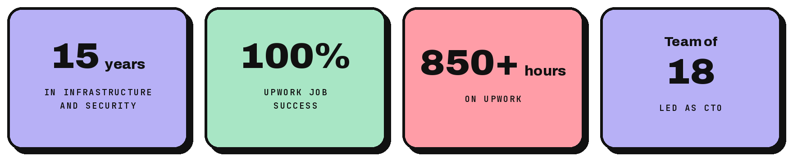
</picture>

<a href="https://faadii.com">
  <picture><source media="(prefers-color-scheme: dark)" srcset="cards/status-dark.png">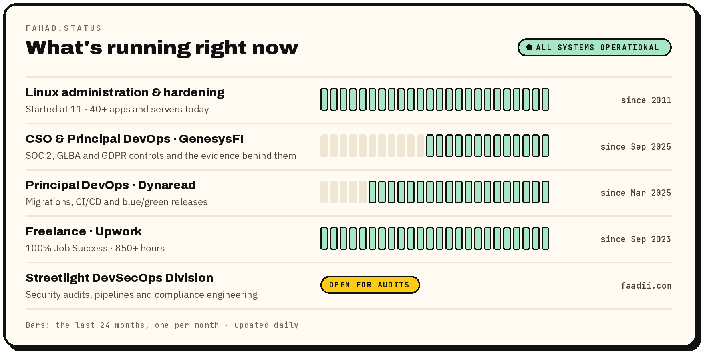</picture>
</a>

## What I do

- **DevOps & Cloud Infrastructure** — pipelines, migrations and deployments that don't need you awake at 2 am. CI/CD on GitHub Actions and GitLab CI, blue/green deployments with zero downtime, containers, Kubernetes and multi-cloud migrations.
- **Security & Compliance Engineering** — the controls and the evidence an auditor asks for, built, not promised. SOC 2, GLBA and GDPR control and evidence systems, zero-trust network segmentation, IAM audits, centralised audit logging and sensitive-data redaction in log pipelines.
- **Observability & Reliability** — know it's broken before your customers tell you. Loki and ELK pipelines into immutable storage, Prometheus and Grafana dashboards provisioned as code, health probes, retention and disaster-recovery drills.
- **Fractional CTO** — technical leadership for a startup that needs a CTO before it can afford one: architecture, hiring, roadmap and delivery.

`Linux` `GitHub Actions` `GitLab CI` `Docker` `Kubernetes` `Terraform` `GCP` `AWS` `DigitalOcean` `Elasticsearch` `Kibana` `Keycloak` `GCP IAM` `Zero Trust` `Prometheus` `Grafana` `Loki` `Grafana Alloy` `PM2`

## Selected work

- **Genesys Financial Intelligence** — designing and building a compliance-grade observability and audit system for a fintech, as its lead engineer: from nothing to a full compliance evidence system.
- **Homiee** — putting every sale on the right house: the mapping engine behind an Australian property platform, placing 95% of addresses on the right building automatically.

Full case studies, project write-ups and architecture diagrams: **[faadii.com/projects](https://faadii.com/projects)** · Writing: **[faadii.com/blog](https://faadii.com/blog)**

<a href="https://faadii.com/blog">
  <picture><source media="(prefers-color-scheme: dark)" srcset="cards/incidents-dark.png">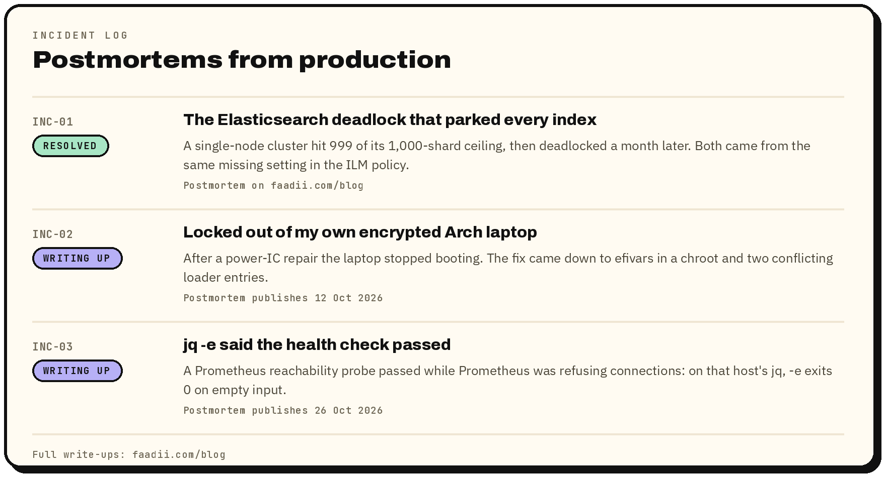</picture>
</a>

## Experience

**Principal DevOps Engineer & Chief Security Officer · Genesys Financial Intelligence**
*Sep 2025 – present · US fintech (remote) · product: Zovox.app, an AI CFO for entrepreneurs*
- Sole infrastructure and security engineer; designed and built the compliance-grade observability and audit system
- SOC 2, GLBA and GDPR control and evidence systems, zero-trust network segmentation, IAM audits, centralised audit logging and sensitive-data redaction in log pipelines
- CI/CD on GitHub Actions with security scans before staging and blue/green deploys to production

**Principal DevOps Engineer · Dynaread**
*Mar 2025 – present · Cranbrook, British Columbia, Canada (remote)*
Educational technology for children with dyslexia.
- Joined as Senior DevOps Engineer, promoted to Principal DevOps Engineer
- Migrated about a dozen websites and web apps from LAMP 5 to LAMP 8, and MySQL 5 to 8
- Moved sites, microservices and databases from GCP to DigitalOcean
- CI/CD on GitLab with multiple runners, blue/green deployments with zero downtime, and Docker for consistent deploys

**CTO & Engineering Lead · Homiee**
*Nov 2023 – Sep 2025 · Sydney, Australia (remote)*
Australian property-technology startup.
- Joined as DevOps Engineer, promoted to CTO & Engineering Lead of a team of 18 (11 developers, 3 designers, 4 data-pipeline engineers)
- Built the mapping engine that places 95% of addresses on the right building automatically
- Set up CI/CD for every microservice and owned every technical side of the company

**Freelance DevOps & Security Engineer · Upwork**
*Sep 2023 – present*
- Started with web scraping and data work and moved into DevOps and security
- Rising Talent within four weeks; held Top Rated for almost a year
- 100% Job Success, 5.0★ rating, 850+ hours

**Junior Web Developer · Zekab Solutions**
*Dec 2022 – Mar 2023 · Lahore*
- React front ends, Express and Node application tiers, Mongoose back ends and DevOps

**Business owner · Tour Takers Pvt. Ltd. and K. Group of Hotels Pvt. Ltd.**
*Aug 2020 – Aug 2022 · Lahore and Kumrat Valley*
- Ran a tour company with four-day tours every weekend, then a seasonal hotel business hosting about 350 guests a week
- Designed, hosted and secured their booking platform on DigitalOcean with Docker

**Before that**
- **2015 – 2019:** web development in JavaScript and PHP, internships at web software houses and about 18 months of game development, alongside freelance hosting work: multi-tenant VPS hosting, Nginx and Apache, early Let's Encrypt automation, automated backups
- **2011 – 2015:** ran Linux servers (CentOS, Debian, Apache2) for gaming communities, starting at 11: bare-metal provisioning, bash bootstrapping and backups, iptables rate-limiting against floods
- **Early years:** first computer at four; command-line tools and Logo at school, then Visual Basic — a calculator, checkers, tic-tac-toe and minesweeper

## Education

- **BS Software Engineering** — COMSATS University Islamabad, Lahore campus (2019 – 2023)
- **Intermediate** — Punjab College, Okara (2015 – 2017)
- **Secondary** — St. Bonaventure's High School, Hyderabad (2005 – 2015)

## Certifications

Click a badge to verify it on Credly.

  <a href="https://www.credly.com/badges/48215324-1c26-4ddd-a66f-7704ee460dcb"><picture><source media="(prefers-color-scheme: dark)" srcset="cards/certs/cloud-devops-dark.png">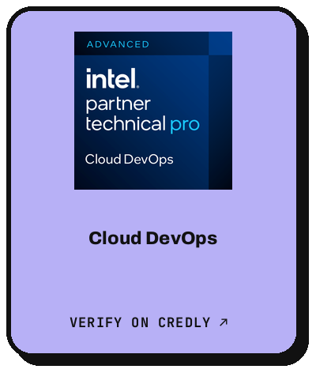</picture></a>
  <a href="https://www.credly.com/badges/57123434-6a79-47fb-a8c5-ddd41377e012"><picture><source media="(prefers-color-scheme: dark)" srcset="cards/certs/zero-trust-security-dark.png">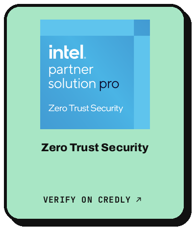</picture></a>
  <a href="https://www.credly.com/badges/eda0b457-f773-460e-b849-75f8274a3104"><picture><source media="(prefers-color-scheme: dark)" srcset="cards/certs/cloud-finops-dark.png">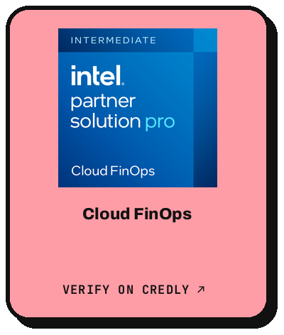</picture></a>
  <a href="https://www.credly.com/badges/d7898e45-c1a2-4695-b541-74603b741c16"><picture><source media="(prefers-color-scheme: dark)" srcset="cards/certs/principles-of-ai-software-ecosystem-dark.png">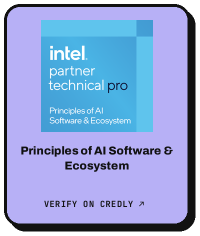</picture></a>
   
  <a href="https://www.credly.com/badges/c96d4610-46fd-4a2e-a7ab-6a3ac5448b98"><picture><source media="(prefers-color-scheme: dark)" srcset="cards/certs/log-querying-analytics-dark.png">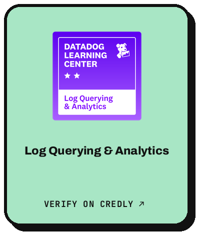</picture></a>
  <a href="https://www.credly.com/badges/4e7cd398-9fcb-416e-84a6-afe43e80c596"><picture><source media="(prefers-color-scheme: dark)" srcset="cards/certs/attacks-threat-detection-dark.png">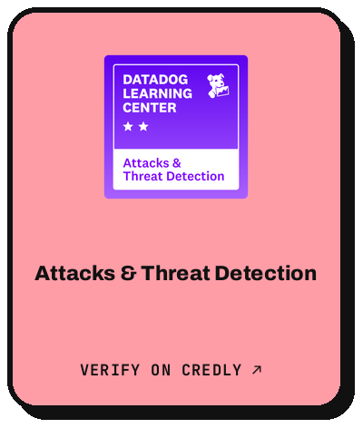</picture></a>
  <a href="https://www.credly.com/badges/7f4fe8bb-3331-4252-87bd-0369b89791da"><picture><source media="(prefers-color-scheme: dark)" srcset="cards/certs/kubernetes-monitoring-dark.png"></picture></a>
  <a href="https://www.credly.com/badges/b7928f07-48e2-43d3-b7ad-3c993f0d1acc"><picture><source media="(prefers-color-scheme: dark)" srcset="cards/certs/log-configuration-processing-dark.png">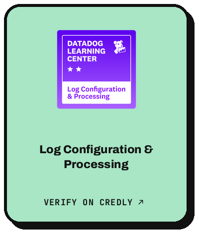</picture></a>
   
  <a href="https://www.credly.com/badges/18f356ae-758b-472c-8ba9-9fb5cbfcab5f"><picture><source media="(prefers-color-scheme: dark)" srcset="cards/certs/site-reliability-engineer-dark.png">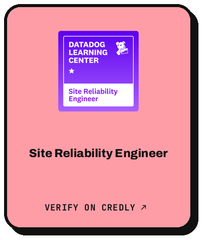</picture></a>
  <a href="https://www.credly.com/badges/27e01b7c-36f7-4791-9153-cacac00f6895"><picture><source media="(prefers-color-scheme: dark)" srcset="cards/certs/application-security-engineer-dark.png">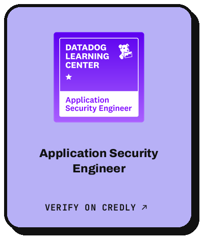</picture></a>
  <a href="https://www.credly.com/badges/09c2b0c8-b479-4455-9c47-42a2645df5e3"><picture><source media="(prefers-color-scheme: dark)" srcset="cards/certs/backend-engineer-dark.png">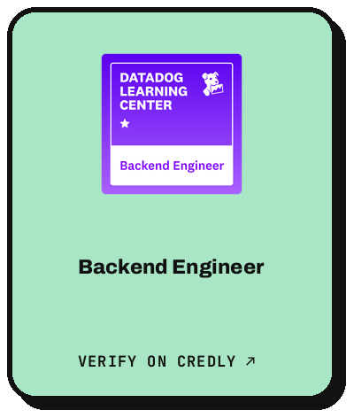</picture></a>
  <a href="https://www.credly.com/badges/863caf75-ce6a-42c6-b85c-bcb75e819ddf"><picture><source media="(prefers-color-scheme: dark)" srcset="cards/certs/cloud-security-engineer-cloud-siem-dark.png">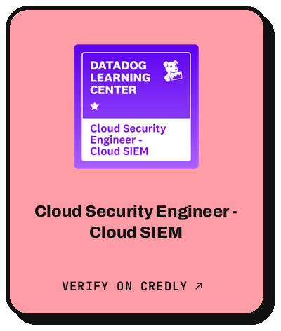</picture></a>
   
  <a href="https://www.credly.com/badges/d8eaed23-2bc3-4b5e-aaec-d5722522e61b"><picture><source media="(prefers-color-scheme: dark)" srcset="cards/certs/cloud-security-engineer-dark.png">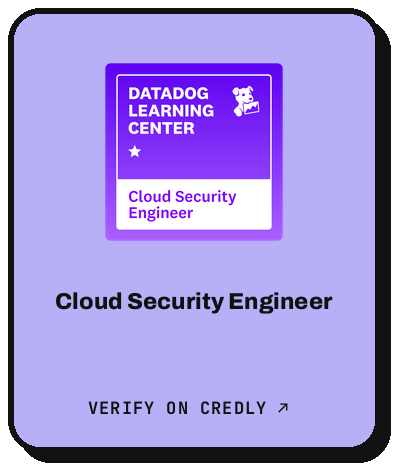</picture></a>
  <a href="https://www.credly.com/badges/d0db85c3-c8f4-411f-a953-10f8be9edde9"><picture><source media="(prefers-color-scheme: dark)" srcset="cards/certs/configuration-dark.png">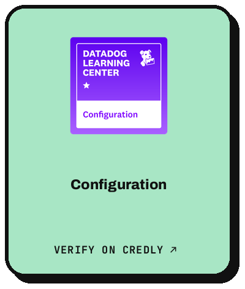</picture></a>
  <a href="https://www.credly.com/badges/e3b962af-b4e2-430d-b973-361aed0b5a7f"><picture><source media="(prefers-color-scheme: dark)" srcset="cards/certs/core-skills-dark.png">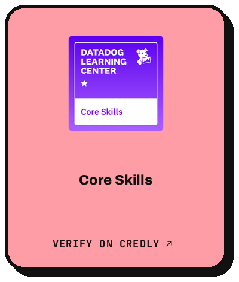</picture></a>
  <a href="https://www.credly.com/badges/681714d4-e881-4f28-9b8f-adf7127646fc"><picture><source media="(prefers-color-scheme: dark)" srcset="cards/certs/log-management-fundamentals-dark.png">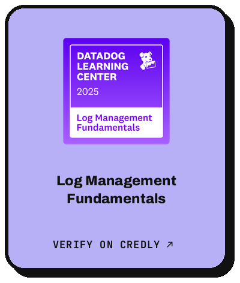</picture></a>

## Code armory

  <a href="https://github.com/Mr-Fahad-Rajput?tab=repositories"><picture><source media="(prefers-color-scheme: dark)" srcset="cards/languages-dark.png">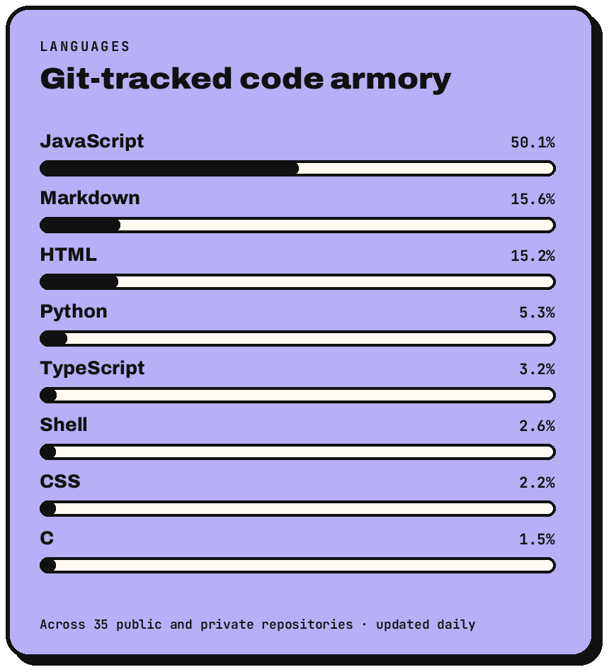</picture></a>

## ~/

  <picture><source media="(prefers-color-scheme: dark)" srcset="cards/terminal-dark.png">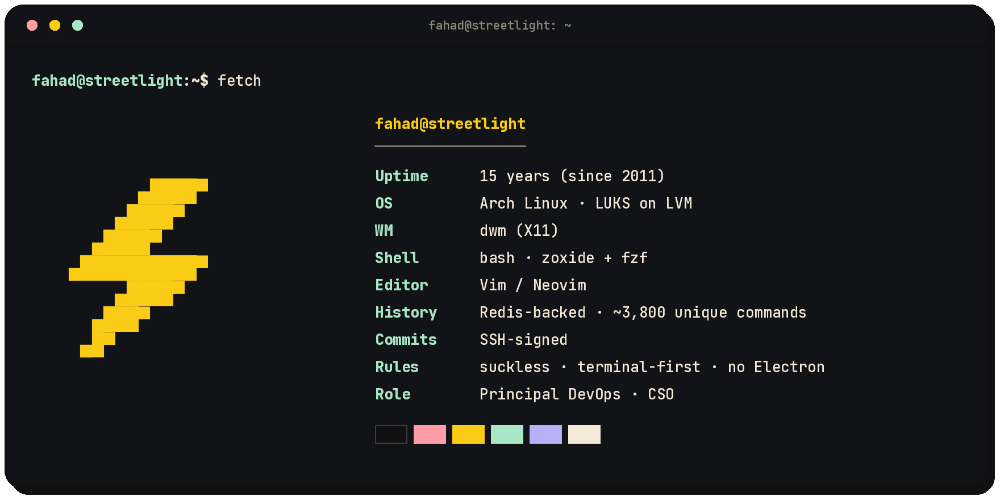</picture>

Most of my work lives in private client repositories, so this profile shows only a small part of it.

<b>Everything else I've worked with</b>

 

**Languages:** JavaScript, TypeScript, Java, C, C++, Python, PHP

**Shell & terminal:** Bash, PowerShell, Zsh, Fish, Vim, Neovim, tmux, GNU Screen, Byobu, GNU coreutils, fzf, ripgrep, bat, fd, lnav, ncdu, lazygit, tig

**Databases:** MySQL, MongoDB, Redis, SQL Server, PostgreSQL, SQLite, Firebase, Supabase, Cassandra, Oracle

**Monitoring:** Prometheus, Grafana, Loki, ELK, Nagios, SigNoz, New Relic

**Web:** React, Redux Toolkit, Next.js, Node.js, Express.js, GraphQL, Three.js, Tailwind CSS, Bootstrap, Sass, Less, jQuery, Webpack, Babel

**Other tools:** Git, ESLint, VS Code, Obsidian, Inkscape, Blender, Unity, Unreal Engine

 

<b>Languages:</b> English, Urdu, Punjabi, Sindhi, Haryanvi, Siraiki · <b>Interests:</b> astrophysics, quantum computing, chess, RAG and MLOps

